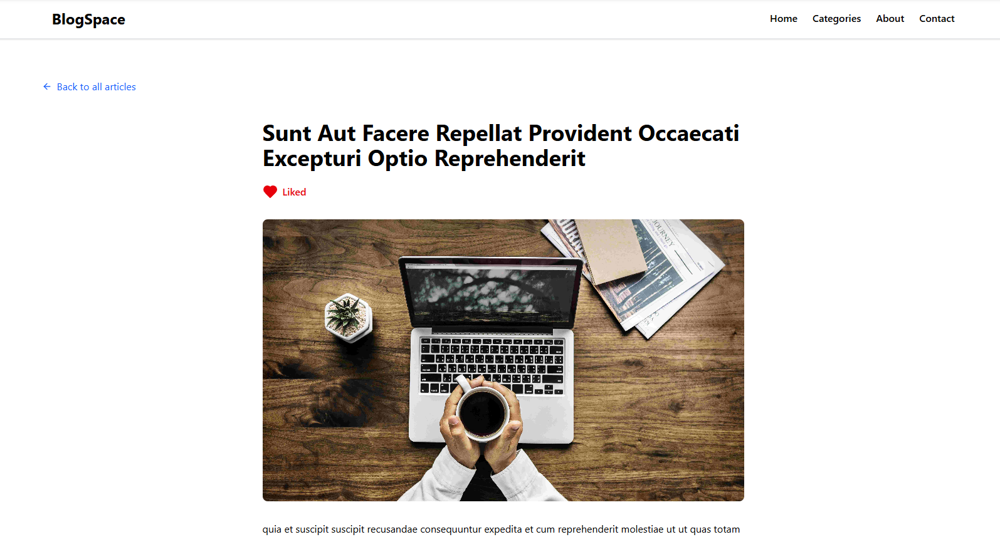

# BlogSpace

A modern blog application built with **React, Redux Toolkit, and Tailwind CSS** that allows users to read blogs, like posts, leave comments, and  and engage interactively.The application ensures smooth state management, a responsive design, and an intuitive user interface for an enhanced blogging experience.

## 🚀 Features

- 📝 **Read Blogs** – Users can explore various blogs and read content.
- 👍 **Like Blogs** – Users can like and unlike blog posts
- 🔃 **Load More** – Users can load more blog posts on demand.
- 💬 **Comment System** – Users can add comments on blog posts, which are stored in Redux state.
- 🔥 **Toast Notifications** – Instant feedback using `react-hot-toast`.
- 🎨 **Responsive UI** – Styled with Tailwind CSS for a seamless experience across devices.

## 📸 Screenshots


| Blog List | Blog Details |
|-----------|-------------|
|  |  |

## 🛠️ Tech Stack

- **Frontend:** React 19, Tailwind CSS
- **State Management:** Redux Toolkit
- **Notifications:** React Hot Toast

## 🔧 Installation & Setup

1. **Clone the repository:**
   ```sh
   git clone https://github.com/your-username/BlogSpace.git
   cd BlogSpace
   ```

2. **Install dependencies:**
   ```sh
   npm install
   ```

3. **Run the application:**
   ```sh
   npm dev
   ```

4. **Open in browser:**
   ```sh
   http://localhost:5173
   ```

## 🛠️ Key Components

- **BlogComments.jsx** – Handles user comments with Redux.
- **BlogList.jsx** – Displays all blogs.
- **Blog.jsx** – Displays individual blog details.
- **Redux Store (blogSlice.js)** – Manages blog data and comments.

## 🚀 Future Enhancements

- ✅ **User Authentication** – Allow users to log in before commenting.
- ✅ **Persistent Comments** – Store comments in a database.
- ✅ **save & Share Feature** – Users can save  and share blogs.
- ✅ **Dark Mode** – Add a dark mode option for a more immersive experience.

## 🤝 Contributing

Contributions are welcome! Feel free to submit issues or create pull requests.


Made with ❤️ by [Sahin Ali](https://github.com/ssali07)

